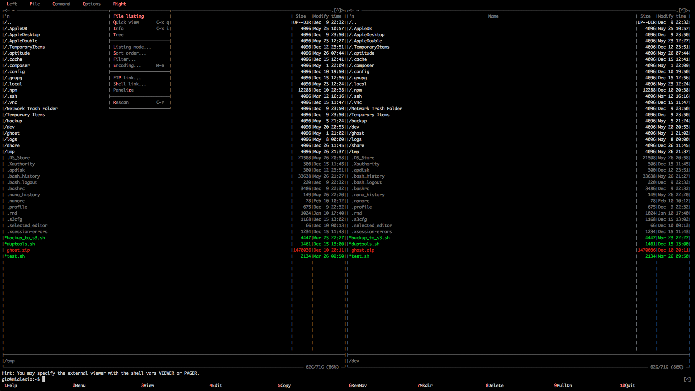

# Dark Night Skin

...is a Midnight Commander skin with built-in installer. I don't know about you, if you're like who use `mc` a lot and sick of the big blue screen of death then it's time to customize it a little bit.

## Usage

The script was tested on Ubuntu 12.04LTS and 13.04LTS and should also work on Debian. As always, you must make your own backup of `ini` file located at `/home/user/.config/mc/ini`.

Yes, it must be run as root or superuser.

	sudo ./install-darknight.sh

That's all there is to it! Enjoy!

## Screenshot

## Copyright & License

Copyright (C) 2014 Gio Bautista - Released under the MIT License.
